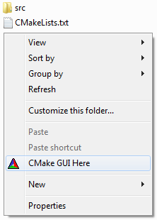

# CMake Context Menu Item

A collection of scripts that add context menu items for launching CMake from the OS file manager.

<table style="width:100%">
  <tr>
    <td style="text-align:left"></td>
    <td style="text-align:right"></td>
  </tr>
</table>

# Features

* Launches CMake GUI from the current folder's context menu
* Automatically sets the source and build directories

# Note for CMake >= 3.13

Up until CMake 3.12, we had to use the undocumented `-H` command line option to specify the source directory (i.e. the directory containing `CMakeLists.txt`).

Starting from [CMake 3.13](https://cmake.org/cmake/help/v3.13/release/3.13.html#command-line), a new `-S` option has been added to specify the source directory.

Therefore, if you have CMake >= 3.13, you must replace `-H` with `-S` in the scripts that are provided by this repo for your file manager.

# Supported File Managers

_(click on the file manager's name to go to the instructions)_

* [Linux](linux)
  * [Dolphin](linux/dolphin/README.md)
  * [Nautilus](linux/nautilus/README.md)
  * [Nemo](linux/nemo/README.md)
  * [Thunar](linux/thunar/README.md)
* [Windows](windows)
  * [Windows File Explorer](windows/explorer/README.md)

# Contributing

Bug fixes and pull requests (e.g. adding support to more file managers) are welcome :)

For the "CMake GUI Here" menu item, the main _trick_ is to launch  `cmake-gui` with the following arguments

  ```sh
  # CMake <= 3.12
  cmake-gui "-H<path to current folder>" "-B<path to current folder>/build"

  # CMake >= 3.13
  cmake-gui "-S<path to current folder>" "-B<path to current folder>/build"
  ```

Note that

* `"-H..."`/`"-S..."` and `"-B..."` are quoted
* There are **no spaces** after `-H`/`-S` and `-B`
