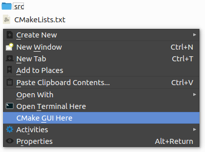

# CMake GUI Here for Dolphin



## Install

1. Make sure that `cmake-gui` is in the `PATH`. If not, you must edit the following line in [`cmake-gui_here.desktop`](cmake-gui_here.desktop)

    ```
    Exec=cmake-gui "-H%f" "-B%f/build"
    ```

    and replace `cmake-gui` with the path to your `cmake-gui` executable

1. Copy `cmake-gui_here.desktop` to one of the following folders:
    * KDE 5
        * `~/.local/share/kservices5/ServiceMenus` (per-user installation)
        * `/usr/share/kservices5/ServiceMenus`     (system-wide installation)
    * KDE < 5
        * `~/.kde/share/kde4/services/ServiceMenus` (per-user installation)
        * `/usr/share/kde4/services/ServiceMenus`   (system-wide installation)

## Usage

1. Right-click on any file in a directory containing a `CMakeLists.txt` file
1. Choose `CMake GUI Here`

## Uninstall

1. Remove [`cmake-gui_here.desktop`](cmake-gui_here.desktop) from its installation folder

## Credit

* http://languor.us/adding-custom-service-menu-kdes-dolphin-queue-folder-vlc
* https://askubuntu.com/a/282187/543097
* https://standards.freedesktop.org/desktop-entry-spec/latest/ar01s07.html
