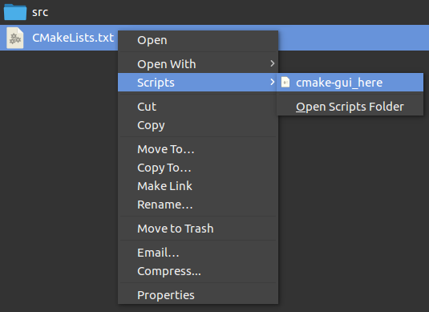

# CMake GUI Here for Nautilus



## Install

1. Make sure that `cmake-gui` is in the `PATH`. If not, you must edit the following line in [`cmake-gui_here`](cmake-gui_here)

    ```
    `cmake-gui` "-H${FOLDER_PATH}" "-B${FOLDER_PATH}/build"
    ```

    and replace `cmake-gui` with the path to your `cmake-gui` executable

1. Copy `cmake-gui_here` to `~/.local/share/nautilus/scripts`

## Usage

1. Right-click on any file in a directory containing a `CMakeLists.txt` file
1. Choose `Scripts > cmake-gui_here`

## Uninstall

1. Remove [`cmake-gui_here`](cmake-gui_here) from its installation folder

## Credit

* https://askubuntu.com/a/672553/543097
* https://help.ubuntu.com/community/NautilusScriptsHowto
