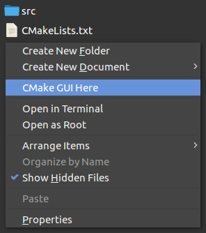

# CMake GUI Here for Nemo



## Install

1. Make sure that `cmake-gui` is in the `PATH`.
If not, you must edit the following line in `cmake-gui_here.nemo_action`

    ```
    Exec='cmake-gui' '-H%P' '-B%P/build'
    ```

    and replace `cmake-gui` with the path to your 'cmake-gui' executable

1. Copy `cmake-gui_here.nemo_action` to
either `~/.local/share/nemo/actions` (per-user installation)
or     `/usr/share/nemo/actions`     (system-wide installation)

## Usage

1. Right-click on the "background" of a directory containing a `CMakeLists.txt` file
1. Choose `CMake GUI Here`

## Uninstall

1. Remove `cmake-gui_here.nemo_action` from its installation folder

## Credit

* https://grvj.wordpress.com/2014/01/19/adding-new-items-in-right-click-context-menu-in-linux-mint-cinnamon/
* https://wiki.archlinux.org/index.php/Nemo#Nemo_Actions
* https://github.com/linuxmint/nemo/blob/3.8.6/files/usr/share/nemo/actions/sample.nemo_action
