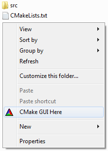

# CMake GUI Here for the Windows File Explorer



## Install

1. Replace the following string in [`add_cmake-gui_here.reg`](add_cmake-gui_here.reg)

    ```
    C:\\Program Files\\CMake\\bin\\cmake-gui.exe
    ```

    with the path to your `cmake-gui.exe` executable

1. Double-click on `add_cmake-gui_here.reg`

## Usage

1. Right-click on the "background" of a directory containing a `CMakeLists.txt` file
1. Choose `CMake GUI Here`

## Uninstall

1. Double-click on [`remove_cmake-gui_here.reg`](remove_cmake-gui_here.reg)

## Credit

* https://www.thewindowsclub.com/remove-click-context-menu-items-editors
* https://stackoverflow.com/q/4902041/865719
